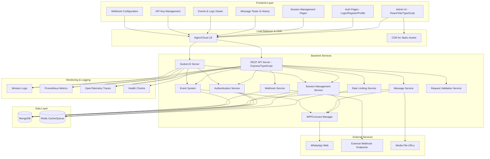

# Design Document

## Overview

The WhatsApp Integration service is designed as a multi-tenant, microservices-oriented platform that provides WhatsApp messaging capabilities through WPPConnect. The system follows a layered architecture with clear separation between the presentation layer (Admin UI), API layer (REST + Socket.IO), business logic layer, and data persistence layer.

The design emphasizes scalability, security, and reliability while maintaining simplicity for both end-users and developers integrating with the platform.

## Architecture

### High-Level Architecture



### Technology Stack

- **Frontend**: React 18 + Vite + TypeScript + Tailwind CSS + Ant Design
- **Backend**: Node.js + TypeScript + Express.js
- **Real-time**: Socket.IO
- **Database**: MongoDB with Mongoose ODM
- **Cache/Queue**: Redis
- **WhatsApp Integration**: WPPConnect library
- **Authentication**: JWT + bcrypt
- **Validation**: Zod with zod-to-openapi
- **Documentation**: Swagger/OpenAPI 3.1
- **Monitoring**: Winston logging + OpenTelemetry + Prometheus metrics

## Frontend-Backend Integration

### Admin UI Architecture

The Admin UI is built as a Single Page Application (SPA) with the following structure:

```
src/
├── components/           # Reusable UI components
│   ├── common/          # Generic components (Button, Modal, etc.)
│   ├── auth/            # Authentication components
│   ├── sessions/        # Session management components
│   ├── messages/        # Message components
│   └── events/          # Event display components
├── pages/               # Page-level components
│   ├── LoginPage.tsx
│   ├── ProfilePage.tsx
│   ├── SessionsPage.tsx
│   ├── MessageTesterPage.tsx
│   ├── EventsPage.tsx
│   └── APIKeysPage.tsx
├── services/            # API integration layer
│   ├── api.ts           # HTTP client configuration
│   ├── auth.service.ts  # Authentication API calls
│   ├── session.service.ts # Session management API calls
│   ├── message.service.ts # Message API calls
│   └── socket.service.ts  # Socket.IO client
├── hooks/               # Custom React hooks
│   ├── useAuth.ts       # Authentication state management
│   ├── useSessions.ts   # Session state management
│   ├── useSocket.ts     # Socket.IO integration
│   └── useMessages.ts   # Message state management
├── store/               # State management (Zustand/Redux)
│   ├── authStore.ts
│   ├── sessionStore.ts
│   └── messageStore.ts
└── utils/               # Utility functions
    ├── constants.ts
    ├── validators.ts
    └── formatters.ts
```

### API Integration Layer

**HTTP Client Configuration:**

```typescript
// services/api.ts
import axios from "axios";

const api = axios.create({
  baseURL: process.env.VITE_API_BASE_URL,
  timeout: 10000,
  withCredentials: true, // For JWT cookies
});

// Request interceptor for API key
api.interceptors.request.use((config) => {
  const apiKey = localStorage.getItem("apiKey");
  if (apiKey) {
    config.headers["x-api-key"] = apiKey;
  }
  return config;
});

// Response interceptor for error handling
api.interceptors.response.use(
  (response) => response,
  (error) => {
    if (error.response?.status === 401) {
      // Redirect to login
      window.location.href = "/login";
    }
    return Promise.reject(error);
  }
);
```

**Socket.IO Integration:**

```typescript
// services/socket.service.ts
import { io, Socket } from "socket.io-client";

class SocketService {
  private socket: Socket | null = null;

  connect(token: string) {
    this.socket = io(process.env.VITE_SOCKET_URL, {
      auth: { token },
      transports: ["websocket"],
    });

    this.setupEventListeners();
  }

  private setupEventListeners() {
    this.socket?.on("qr:update", (data) => {
      // Update QR code in session store
    });

    this.socket?.on("session:state", (data) => {
      // Update session status in store
    });

    this.socket?.on("message:status", (data) => {
      // Update message status in store
    });
  }
}
```

### Real-time UI Updates

**QR Code Component:**

```typescript
// components/sessions/QRCodeDisplay.tsx
import { useEffect, useState } from "react";
import { QRCodeSVG } from "qrcode.react";
import { useSocket } from "../hooks/useSocket";

interface QRCodeDisplayProps {
  sessionId: string;
}

export const QRCodeDisplay: React.FC<QRCodeDisplayProps> = ({ sessionId }) => {
  const [qrData, setQrData] = useState<string>("");
  const [expiresAt, setExpiresAt] = useState<Date>();
  const socket = useSocket();

  useEffect(() => {
    socket.on("qr:update", (data) => {
      if (data.sessionId === sessionId) {
        setQrData(data.qrData);
        setExpiresAt(new Date(data.expiresAt));
      }
    });

    return () => socket.off("qr:update");
  }, [sessionId, socket]);

  return (
    <div className="qr-container">
      {qrData && <QRCodeSVG value={qrData} size={256} className="mx-auto" />}
      {expiresAt && (
        <p className="text-sm text-gray-500 mt-2">
          Expires: {expiresAt.toLocaleTimeString()}
        </p>
      )}
    </div>
  );
};
```

## Components and Interfaces

### 1. Authentication Service

**Purpose**: Handles user authentication, JWT token management, and API key validation.

**Key Methods**:

- `authenticateUser(email, password)` → JWT token
- `validateJWT(token)` → User context
- `generateAPIKey(userId, label)` → API key
- `validateAPIKey(key)` → User context
- `enableTwoFactor(userId, secret)` → Boolean
- `validateTOTP(userId, code)` → Boolean

**Interfaces**:

```typescript
interface AuthService {
  authenticateUser(credentials: LoginCredentials): Promise<AuthResult>;
  validateJWT(token: string): Promise<UserContext>;
  generateAPIKey(userId: string, label?: string): Promise<APIKey>;
  validateAPIKey(key: string): Promise<UserContext>;
}

interface UserContext {
  userId: string;
  email: string;
  permissions: string[];
}
```

### 2. Session Manager

**Purpose**: Manages WhatsApp session lifecycle, WPPConnect client instances, and session state.

**Key Methods**:

- `createSession(userId, deviceName)` → Session
- `deleteSession(sessionId)` → Boolean
- `getSessionStatus(sessionId)` → SessionStatus
- `rehydrateSessions()` → void (startup recovery)
- `handleQRUpdate(sessionId, qrData)` → void
- `handleConnectionChange(sessionId, status)` → void

**Interfaces**:

```typescript
interface SessionManager {
  createSession(userId: string, deviceName?: string): Promise<Session>;
  deleteSession(sessionId: string): Promise<boolean>;
  getSession(sessionId: string): Promise<Session | null>;
  getUserSessions(userId: string): Promise<Session[]>;
  rehydrateSessions(): Promise<void>;
}

interface Session {
  sessionId: string;
  userId: string;
  status: SessionStatus;
  deviceInfo?: DeviceInfo;
  phone?: string;
  lastSeenAt?: Date;
  createdAt: Date;
}

enum SessionStatus {
  PENDING = "PENDING",
  QR = "QR",
  CONNECTED = "CONNECTED",
  DISCONNECTED = "DISCONNECTED",
  EXPIRED = "EXPIRED",
  ERROR = "ERROR",
}
```

### 3. Message Service

**Purpose**: Handles message sending, status tracking, and delivery receipts.

**Key Methods**:

- `sendTextMessage(sessionId, to, message)` → MessageResult
- `sendMediaMessage(sessionId, to, mediaPayload)` → MessageResult
- `sendLocationMessage(sessionId, to, location)` → MessageResult
- `updateMessageStatus(messageId, status)` → void
- `getMessageHistory(sessionId, filters)` → Message[]

**Interfaces**:

```typescript
interface MessageService {
  sendMessage(
    sessionId: string,
    payload: MessagePayload
  ): Promise<MessageResult>;
  getMessageStatus(messageId: string): Promise<MessageStatus>;
  getMessageHistory(
    sessionId: string,
    filters: MessageFilters
  ): Promise<Message[]>;
}

interface MessagePayload {
  to: string;
  type: "text" | "image" | "document" | "audio" | "video" | "location";
  content?: string;
  url?: string;
  caption?: string;
  latitude?: number;
  longitude?: number;
}

interface MessageResult {
  messageId: string;
  status: MessageStatus;
  error?: string;
}

enum MessageStatus {
  QUEUED = "QUEUED",
  SENT = "SENT",
  DELIVERED = "DELIVERED",
  READ = "READ",
  FAILED = "FAILED",
}
```

### 4. Event System

**Purpose**: Manages event persistence, webhook delivery, and real-time notifications.

**Key Methods**:

- `recordEvent(event)` → void
- `deliverWebhook(userId, event)` → void
- `emitSocketEvent(userId, event)` → void
- `getEvents(userId, filters)` → Event[]
- `retryFailedWebhooks()` → void

**Interfaces**:

```typescript
interface EventSystem {
  recordEvent(event: SystemEvent): Promise<void>;
  deliverWebhooks(userId: string, event: SystemEvent): Promise<void>;
  emitSocketEvent(userId: string, event: SystemEvent): Promise<void>;
  getEvents(userId: string, filters: EventFilters): Promise<SystemEvent[]>;
}

interface SystemEvent {
  eventId: string;
  userId: string;
  sessionId?: string;
  type: EventType;
  payload: any;
  timestamp: Date;
}

enum EventType {
  SESSION_STATE = "SESSION_STATE",
  MESSAGE_SENT = "MESSAGE_SENT",
  MESSAGE_DELIVERED = "MESSAGE_DELIVERED",
  MESSAGE_READ = "MESSAGE_READ",
  QR_REFRESHED = "QR_REFRESHED",
  ERROR = "ERROR",
}
```

### 5. WPPConnect Integration Layer

**Purpose**: Abstracts WPPConnect library interactions and manages client lifecycle.

**Key Methods**:

- `initializeClient(sessionId, config)` → WPPClient
- `destroyClient(sessionId)` → void
- `sendMessage(sessionId, payload)` → Promise
- `refreshQR(sessionId)` → void
- `getClientStatus(sessionId)` → ClientStatus

**Interfaces**:

```typescript
interface WPPConnectManager {
  initializeClient(sessionId: string, config: WPPConfig): Promise<void>;
  destroyClient(sessionId: string): Promise<void>;
  sendMessage(sessionId: string, payload: any): Promise<any>;
  refreshQR(sessionId: string): Promise<void>;
  getClientStatus(sessionId: string): ClientStatus;
}

interface WPPConfig {
  session: string;
  deviceName?: string;
  headless: boolean;
  devtools: boolean;
  useChrome: boolean;
  debug: boolean;
  logQR: boolean;
  browserArgs: string[];
}
```

### 6. Rate Limiting Service

**Purpose**: Implements per-API-key and per-IP rate limiting with Redis backend.

**Key Methods**:

- `checkRateLimit(key, limit, window)` → RateLimitResult
- `incrementCounter(key, window)` → number
- `getRemainingRequests(key)` → number
- `resetRateLimit(key)` → void

**Interfaces**:

```typescript
interface RateLimitService {
  checkRateLimit(
    key: string,
    limit: number,
    windowMs: number
  ): Promise<RateLimitResult>;
  incrementCounter(key: string, windowMs: number): Promise<number>;
  getRemainingRequests(key: string): Promise<number>;
}

interface RateLimitResult {
  allowed: boolean;
  remaining: number;
  resetTime: Date;
  retryAfter?: number;
}
```

### 7. Validation Service

**Purpose**: Centralized request validation using Zod schemas.

**Key Methods**:

- `validateRequest(schema, data)` → ValidationResult
- `validatePhoneNumber(phone)` → boolean
- `validateMediaUrl(url, type)` → ValidationResult
- `sanitizeInput(input)` → string

**Interfaces**:

```typescript
interface ValidationService {
  validateRequest<T>(schema: ZodSchema<T>, data: unknown): ValidationResult<T>;
  validatePhoneNumber(phone: string): boolean;
  validateMediaUrl(
    url: string,
    type: MediaType
  ): Promise<ValidationResult<MediaInfo>>;
}

interface ValidationResult<T = any> {
  success: boolean;
  data?: T;
  errors?: ValidationError[];
}
```

### 8. Webhook Service

**Purpose**: Manages webhook delivery, retries, and HMAC signing.

**Key Methods**:

- `deliverWebhook(webhook, event)` → DeliveryResult
- `retryFailedWebhooks()` → void
- `signPayload(payload, secret)` → string
- `validateWebhookUrl(url)` → boolean

**Interfaces**:

```typescript
interface WebhookService {
  deliverWebhook(webhook: Webhook, event: SystemEvent): Promise<DeliveryResult>;
  retryFailedWebhooks(): Promise<void>;
  signPayload(payload: string, secret: string): string;
  validateWebhookUrl(url: string): Promise<boolean>;
}

interface DeliveryResult {
  success: boolean;
  statusCode?: number;
  error?: string;
  retryAfter?: number;
}
```

## Backend Module Structure

### Express.js Application Structure

```
src/
├── app.ts                    # Express app configuration
├── server.ts                 # Server startup and graceful shutdown
├── config/                   # Configuration management
│   ├── database.ts           # MongoDB connection
│   ├── redis.ts              # Redis connection
│   ├── environment.ts        # Environment variables
│   └── constants.ts          # Application constants
├── middleware/               # Express middleware
│   ├── auth.middleware.ts    # JWT/API key validation
│   ├── rateLimit.middleware.ts # Rate limiting
│   ├── validation.middleware.ts # Request validation
│   ├── cors.middleware.ts    # CORS configuration
│   ├── logging.middleware.ts # Request logging
│   └── error.middleware.ts   # Error handling
├── routes/                   # API route definitions
│   ├── auth.routes.ts        # Authentication endpoints
│   ├── sessions.routes.ts    # Session management
│   ├── messages.routes.ts    # Message sending
│   ├── events.routes.ts      # Event retrieval
│   ├── webhooks.routes.ts    # Webhook management
│   └── health.routes.ts      # Health checks
├── controllers/              # Route handlers
│   ├── auth.controller.ts
│   ├── sessions.controller.ts
│   ├── messages.controller.ts
│   ├── events.controller.ts
│   └── webhooks.controller.ts
├── services/                 # Business logic layer
│   ├── auth.service.ts
│   ├── session.service.ts
│   ├── message.service.ts
│   ├── event.service.ts
│   ├── webhook.service.ts
│   ├── rateLimit.service.ts
│   └── validation.service.ts
├── models/                   # Database models (Mongoose)
│   ├── User.model.ts
│   ├── APIKey.model.ts
│   ├── Session.model.ts
│   ├── Message.model.ts
│   ├── Event.model.ts
│   └── Webhook.model.ts
├── wpp/                      # WPPConnect integration
│   ├── manager.ts            # Client manager
│   ├── client.ts             # Individual client wrapper
│   ├── events.ts             # Event handlers
│   └── types.ts              # Type definitions
├── socket/                   # Socket.IO implementation
│   ├── server.ts             # Socket.IO server setup
│   ├── auth.ts               # Socket authentication
│   ├── handlers/             # Event handlers
│   │   ├── session.handler.ts
│   │   ├── message.handler.ts
│   │   └── event.handler.ts
│   └── types.ts              # Socket event types
├── utils/                    # Utility functions
│   ├── logger.ts             # Winston logger setup
│   ├── crypto.ts             # Encryption utilities
│   ├── validators.ts         # Zod schemas
│   ├── errors.ts             # Custom error classes
│   └── helpers.ts            # General helpers
├── types/                    # TypeScript type definitions
│   ├── api.types.ts          # API request/response types
│   ├── database.types.ts     # Database document types
│   ├── wpp.types.ts          # WPPConnect types
│   └── common.types.ts       # Shared types
└── tests/                    # Test files
    ├── unit/                 # Unit tests
    ├── integration/          # Integration tests
    ├── e2e/                  # End-to-end tests
    └── fixtures/             # Test data
```

### API Route Structure

**Authentication Routes (`/api/v1/auth`)**:

- `POST /register` - User registration
- `POST /login` - User login
- `POST /logout` - User logout
- `POST /refresh` - Token refresh
- `GET /profile` - Get user profile
- `PUT /profile` - Update user profile
- `POST /2fa/enable` - Enable 2FA
- `POST /2fa/disable` - Disable 2FA
- `POST /2fa/verify` - Verify 2FA code

**Session Routes (`/api/v1/sessions`)**:

- `GET /` - List user sessions
- `POST /` - Create new session
- `GET /:sessionId` - Get session details
- `DELETE /:sessionId` - Delete session
- `POST /:sessionId/refresh-qr` - Refresh QR code
- `GET /:sessionId/qr` - Get current QR code
- `GET /:sessionId/events` - Get session events

**Message Routes (`/api/v1/messages`)**:

- `POST /send` - Send message
- `GET /:messageId` - Get message status
- `GET /` - Get message history (with filters)

**Event Routes (`/api/v1/events`)**:

- `GET /` - Get events (with filters)
- `GET /types` - Get available event types

**Webhook Routes (`/api/v1/webhooks`)**:

- `GET /` - List webhooks
- `POST /` - Create webhook
- `PUT /:webhookId` - Update webhook
- `DELETE /:webhookId` - Delete webhook
- `POST /:webhookId/test` - Test webhook delivery

**API Key Routes (`/api/v1/api-keys`)**:

- `GET /` - List API keys (masked)
- `POST /` - Create API key
- `DELETE /:keyId` - Revoke API key

### Socket.IO Event Structure

**Client → Server Events**:

- `session:create` - Create new session
- `session:delete` - Delete session
- `session:refresh_qr` - Refresh QR code
- `message:send` - Send message
- `events:subscribe` - Subscribe to events

**Server → Client Events**:

- `qr:update` - QR code updated
- `session:state` - Session status changed
- `message:status` - Message status updated
- `error` - Error occurred
- `connected` - Socket connected
- `disconnected` - Socket disconnected

## Data Models

### MongoDB Collections

#### Users Collection

```typescript
interface User {
  _id: ObjectId;
  email: string; // unique index
  passwordHash: string;
  name: string;
  twoFAEnabled: boolean;
  twoFASecret?: string;
  createdAt: Date;
  updatedAt: Date;
}
```

#### API Keys Collection

```typescript
interface APIKey {
  _id: ObjectId;
  userId: ObjectId;
  keyHash: string; // SHA-256 hash
  keyPrefix: string; // first 8 chars for display
  label?: string;
  lastUsedAt?: Date;
  createdAt: Date;
  revokedAt?: Date;
}
```

#### Sessions Collection

```typescript
interface SessionDocument {
  _id: ObjectId;
  userId: ObjectId;
  sessionId: string; // UUID, unique index
  status: SessionStatus;
  deviceInfo?: {
    name: string;
    platform: string;
    version: string;
  };
  phone?: string;
  lastSeenAt?: Date;
  wppState?: any; // Raw WPPConnect state for debugging
  createdAt: Date;
  updatedAt: Date;
}
```

#### QR Events Collection

```typescript
interface QREvent {
  _id: ObjectId;
  userId: ObjectId;
  sessionId: string;
  qrData: string;
  expiresAt: Date;
  tries: number;
  createdAt: Date;
}
// TTL index on expiresAt
```

#### Events Collection

```typescript
interface EventDocument {
  _id: ObjectId;
  userId: ObjectId;
  sessionId?: string;
  type: EventType;
  payload: any;
  createdAt: Date;
}
// Compound index on userId, sessionId, createdAt
```

#### Messages Collection

```typescript
interface MessageDocument {
  _id: ObjectId;
  userId: ObjectId;
  sessionId: string;
  messageId: string; // unique
  to: string;
  type: MessageType;
  content?: string;
  mediaUrl?: string;
  caption?: string;
  status: MessageStatus;
  error?: string;
  metadata?: any;
  createdAt: Date;
  updatedAt: Date;
}
```

#### Webhooks Collection

```typescript
interface WebhookDocument {
  _id: ObjectId;
  userId: ObjectId;
  url: string;
  description?: string;
  secret: string; // for HMAC signing
  isActive: boolean;
  eventTypes: EventType[];
  createdAt: Date;
  updatedAt: Date;
  lastResponseCode?: number;
  lastError?: string;
}
```

### Redis Data Structures

#### Rate Limiting

```
Key: rate_limit:{apiKey}:{endpoint}
Value: {count: number, resetAt: timestamp}
TTL: Based on rate limit window
```

#### Session Cache

```
Key: session:{sessionId}
Value: {status, lastSeen, phone}
TTL: 1 hour
```

#### Idempotency Keys

```
Key: idempotency:{userId}:{key}
Value: {messageId, response}
TTL: 24 hours
```

## Error Handling

### Error Response Format

```typescript
interface ErrorResponse {
  error: {
    code: string;
    message: string;
    details?: any;
    timestamp: string;
    requestId: string;
  };
}
```

### Error Codes

- `UNAUTHORIZED` - Invalid credentials or token
- `FORBIDDEN` - Access denied to resource
- `NOT_FOUND` - Resource doesn't exist
- `RATE_LIMITED` - Too many requests
- `VALIDATION_ERROR` - Invalid input data
- `SESSION_NOT_CONNECTED` - WhatsApp session not ready
- `WPP_ERROR` - WPPConnect library error
- `INTERNAL` - Server error

### Error Handling Strategy

1. **Input Validation**: Use Zod schemas for request validation
2. **Business Logic Errors**: Custom error classes with specific codes
3. **External Service Errors**: Wrap WPPConnect errors with context
4. **Database Errors**: Retry logic with exponential backoff
5. **Webhook Delivery Errors**: Dead letter queue with manual retry

## Testing Strategy

### Unit Tests

- **Authentication Service**: JWT generation/validation, password hashing
- **Session Manager**: Session lifecycle, state transitions
- **Message Service**: Message validation, status tracking
- **Event System**: Event persistence, webhook delivery
- **WPPConnect Manager**: Client lifecycle, error handling

### Integration Tests

- **API Endpoints**: Full request/response cycle with test database
- **Socket.IO Events**: Real-time event emission and reception
- **Database Operations**: CRUD operations with proper isolation
- **Webhook Delivery**: HTTP client mocking and retry logic

### End-to-End Tests

- **User Registration/Login Flow**: Complete authentication process
- **Session Creation**: QR generation and mock device pairing
- **Message Sending**: Full message lifecycle with status updates
- **Real-time Updates**: Socket.IO event propagation
- **Admin UI Workflows**: Critical user journeys with Cypress

### Performance Tests

- **Load Testing**: Concurrent API requests with k6
- **Rate Limiting**: Verify limits are enforced correctly
- **Database Performance**: Query optimization and indexing
- **Memory Usage**: WPPConnect client memory management

### Security Tests

- **Authentication**: Token validation, session hijacking prevention
- **Authorization**: Multi-tenant data isolation
- **Input Validation**: SQL injection, XSS prevention
- **Rate Limiting**: DDoS protection effectiveness

## Security Considerations

### Authentication & Authorization

- JWT tokens with short expiration (15 minutes) and refresh tokens
- API keys with SHA-256 hashing and prefix display only
- TOTP-based 2FA with time window validation
- Multi-tenant data isolation at query level

### Data Protection

- Password hashing with bcrypt (12 rounds minimum)
- Webhook HMAC signatures with SHA-256
- Request signing for high-security endpoints
- Audit logging for all user actions

### Network Security

- HTTPS enforcement with HSTS headers
- CORS configuration for Admin UI
- Rate limiting per API key and IP
- Request size limits and timeout enforcement

### Input Validation

- Zod schema validation for all inputs
- Phone number E.164 format validation
- Media file type and size validation
- URL validation for webhook endpoints

## Performance Optimizations

### Caching Strategy

- Redis caching for session status and user data
- MongoDB query result caching for read-heavy operations
- CDN for static Admin UI assets
- Browser caching with appropriate headers

### Database Optimization

- Compound indexes for multi-field queries
- TTL indexes for temporary data (QR events)
- Connection pooling with appropriate limits
- Query optimization with explain plans

### Application Performance

- Connection pooling for MongoDB and Redis
- Async/await patterns for non-blocking operations
- Event loop monitoring and blocking operation detection
- Memory usage monitoring for WPPConnect clients

### Scalability Patterns

- Stateless API servers for horizontal scaling
- Session affinity for Socket.IO connections
- Database sharding by userId hash
- Message queue for webhook delivery

## Monitoring and Observability

### Logging

- Structured JSON logging with Winston
- Log levels: ERROR, WARN, INFO, DEBUG
- Request/response logging with correlation IDs
- Security event logging for audit trails

### Metrics

- Prometheus metrics for API performance
- Custom metrics for WPPConnect client health
- Database query performance metrics
- Rate limiting and error rate metrics

### Tracing

- OpenTelemetry distributed tracing
- Request correlation across services
- Database query tracing
- External API call tracing

### Health Checks

- Liveness probe: Basic server responsiveness
- Readiness probe: Database and Redis connectivity
- WPPConnect client health monitoring
- Webhook endpoint availability checks

### Alerting

- High error rates or response times
- Database connection failures
- WPPConnect client disconnections
- Webhook delivery failures
- Rate limit threshold breaches

## Deployment Architecture

### Docker Configuration

**Frontend Dockerfile:**

```dockerfile
FROM node:18-alpine AS builder
WORKDIR /app
COPY package*.json ./
RUN npm ci
COPY . .
RUN npm run build

FROM nginx:alpine
COPY --from=builder /app/dist /usr/share/nginx/html
COPY nginx.conf /etc/nginx/nginx.conf
EXPOSE 80
```

**Backend Dockerfile:**

```dockerfile
FROM node:18-alpine
WORKDIR /app
COPY package*.json ./
RUN npm ci --only=production
COPY dist ./dist
EXPOSE 3000
CMD ["node", "dist/server.js"]
```

**Docker Compose (Development):**

```yaml
version: "3.8"
services:
  frontend:
    build: ./frontend
    ports:
      - "3000:80"
    environment:
      - VITE_API_BASE_URL=http://localhost:3001/api/v1
      - VITE_SOCKET_URL=http://localhost:3001

  backend:
    build: ./backend
    ports:
      - "3001:3000"
    environment:
      - NODE_ENV=development
      - MONGODB_URI=mongodb://mongo:27017/whatsapp-integration
      - REDIS_URL=redis://redis:6369
    depends_on:
      - mongo
      - redis

  mongo:
    image: mongo:6
    ports:
      - "27017:27017"
    volumes:
      - mongo_data:/data/db

  redis:
    image: redis:7-alpine
    ports:
      - "6369:6369"
    volumes:
      - redis_data:/data

volumes:
  mongo_data:
  redis_data:
```

### Production Deployment

**Kubernetes Manifests:**

- Frontend: Static files served by CDN + Nginx ingress
- Backend: Horizontal Pod Autoscaler with 2-10 replicas
- MongoDB: StatefulSet with persistent volumes
- Redis: Deployment with persistent storage
- Ingress: SSL termination and load balancing

**Environment Variables:**

```bash
# Backend
NODE_ENV=production
PORT=3000
MONGODB_URI=mongodb://mongo-cluster/whatsapp-integration
REDIS_URL=redis://redis-cluster:6369
JWT_SECRET=<secure-random-string>
API_KEY_SALT=<secure-random-string>
WEBHOOK_SIGNING_SECRET=<secure-random-string>

# Frontend
VITE_API_BASE_URL=https://api.example.com/api/v1
VITE_SOCKET_URL=https://api.example.com
```

## Integration Patterns

### Frontend-Backend Communication

**HTTP API Integration:**

```typescript
// Frontend service layer
class SessionService {
  async createSession(deviceName?: string): Promise<Session> {
    const response = await api.post("/sessions", { deviceName });
    return response.data;
  }

  async getSessions(): Promise<Session[]> {
    const response = await api.get("/sessions");
    return response.data;
  }

  async deleteSession(sessionId: string): Promise<void> {
    await api.delete(`/sessions/${sessionId}`);
  }
}
```

**Real-time Socket Integration:**

```typescript
// Frontend socket hook
export const useSocket = () => {
  const [socket, setSocket] = useState<Socket | null>(null);
  const { token } = useAuth();

  useEffect(() => {
    if (token) {
      const newSocket = io(SOCKET_URL, {
        auth: { token },
        transports: ["websocket"],
      });

      setSocket(newSocket);

      return () => newSocket.close();
    }
  }, [token]);

  return socket;
};
```

**State Management Integration:**

```typescript
// Frontend store integration
export const useSessionStore = create<SessionStore>((set, get) => ({
  sessions: [],
  loading: false,

  fetchSessions: async () => {
    set({ loading: true });
    try {
      const sessions = await sessionService.getSessions();
      set({ sessions, loading: false });
    } catch (error) {
      set({ loading: false });
      throw error;
    }
  },

  updateSessionStatus: (sessionId: string, status: SessionStatus) => {
    set((state) => ({
      sessions: state.sessions.map((session) =>
        session.sessionId === sessionId ? { ...session, status } : session
      ),
    }));
  },
}));
```

### Error Handling Integration

**Backend Error Middleware:**

```typescript
export const errorHandler: ErrorRequestHandler = (err, req, res, next) => {
  const errorResponse: ErrorResponse = {
    error: {
      code: err.code || "INTERNAL",
      message: err.message || "Internal server error",
      details: err.details,
      timestamp: new Date().toISOString(),
      requestId: req.id,
    },
  };

  logger.error("API Error", { error: err, requestId: req.id });

  const statusCode = getStatusCodeFromError(err);
  res.status(statusCode).json(errorResponse);
};
```

**Frontend Error Handling:**

```typescript
// Global error boundary
export const ErrorBoundary: React.FC<{ children: React.ReactNode }> = ({
  children,
}) => {
  return (
    <ReactErrorBoundary
      FallbackComponent={ErrorFallback}
      onError={(error, errorInfo) => {
        logger.error("React Error", { error, errorInfo });
      }}
    >
      {children}
    </ReactErrorBoundary>
  );
};

// API error handling
api.interceptors.response.use(
  (response) => response,
  (error) => {
    const errorMessage =
      error.response?.data?.error?.message || "An error occurred";
    toast.error(errorMessage);

    if (error.response?.status === 401) {
      authStore.logout();
      navigate("/login");
    }

    return Promise.reject(error);
  }
);
```

This comprehensive design provides a complete, integrated solution for both frontend and backend components with proper communication patterns, error handling, deployment strategies, and all necessary modules for the WhatsApp Integration service.
